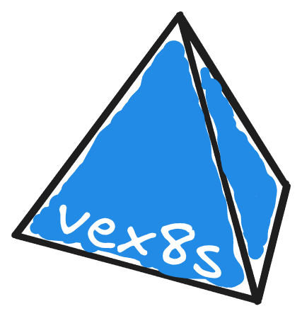

# Vex8s


(this logo is not AI generated)

Vex8s generates [VEX](https://www.ntia.gov/files/ntia/publications/vex_one-page_summary.pdf) documents by correlating container vulnerabilities with Kubernetes `securityContext` to determine which CVEs are actually exploitable in your cluster.

Please note, this is an experimental project. Things might change quickly.

## How It Works

The project aims to assess the exploitability of known CVEs within Kubernetes workloads by combining vulnerability classification and [`securityContext`](https://kubernetes.io/docs/tasks/configure-pod-container/security-context/) analysis.

It is based on the following concept:

* Each CVE is categorized into one or more vulnerability classes ([CWE](https://cwe.mitre.org/index.html))
* Each class, maps to a set of Kubernetes `securityContext` settings that can block or reduce the impact.
* By parsing a Kubernetes manifest, we can inspect the container's `securityContext` to evaluate whether the relevant settings are in place.
* Combining both analyses allows the system to determine if a CVE is exploitable in a given workload configuration.
* If it results in a CVE mitigation, we add this to the final VEX document.

## Installation

You can build it manually:

```
make build
```

## Usage

`vex8s` currently supports 2 ways to generate VEX documents:

* **passive-mode**: passing an already generated vulnerability report created by `trivy` or `grype`.

* **active-mode**: actively scanning the images using `trivy` or `grype` engines and then gereating the document based on the results.

### Passive mode (recommended)

Using `trivy`:

```
# generate vulnerability report.
trivy image --format json --output nginx.trivy.json nginx:1.21.0

# generate VEX document by processing vulnerability report.
vex8s generate --manifest examples/nginx.yaml --report nginx.trivy.json --output nginx.vex.json

# scan again with VEX document to suppress vulnerabilities.
trivy image --vex nginx.vex.json --show-suppressed nginx:1.21.0
```

The same can be applied using `grype`:

```
# generate sbom report.
grype --output cyclonedx-json --file nginx.grype.json nginx:1.21.0

# generate vulnerability report.
grype sbom:./nginx.grype.json --output json --file nginx.grype-vr.json

# generate VEX document by processing vulnerability report.
vex8s generate --manifest examples/nginx.yaml --report nginx.grype-vr.json --output nginx.vex.json

# scan sbom with VEX document to suppress vulnerabilities.
grype sbom:./nginx.grype.json --output table --vex nginx.vex.json --show-suppressed
```

### Active mode

Using `trivy`:

```
# scan the image and automatically generate VEX document.
vex8s generate --manifest examples/nginx.yaml --scan.engine trivy --output nginx.vex.json

# scan again with VEX document to suppress vulnerabilities.
trivy image --vex nginx.vex.json --show-suppressed nginx:1.21.0
```

The same can be applied using `grype`:

```
# generate sbom report.
grype --output cyclonedx-json --file nginx.grype.json nginx:1.21.0

# scan the image and automatically generate VEX document.
vex8s generate --manifest examples/nginx.yaml --scan.engine grype --output nginx.vex.json

# scan sbom with VEX document to suppress vulnerabilities.
grype sbom:./nginx.grype.json --output table --vex nginx.vex.json --show-suppressed
```

## References

This project was inspired by Akihiro Suda's project [vexllm](https://github.com/AkihiroSuda/vexllm).
