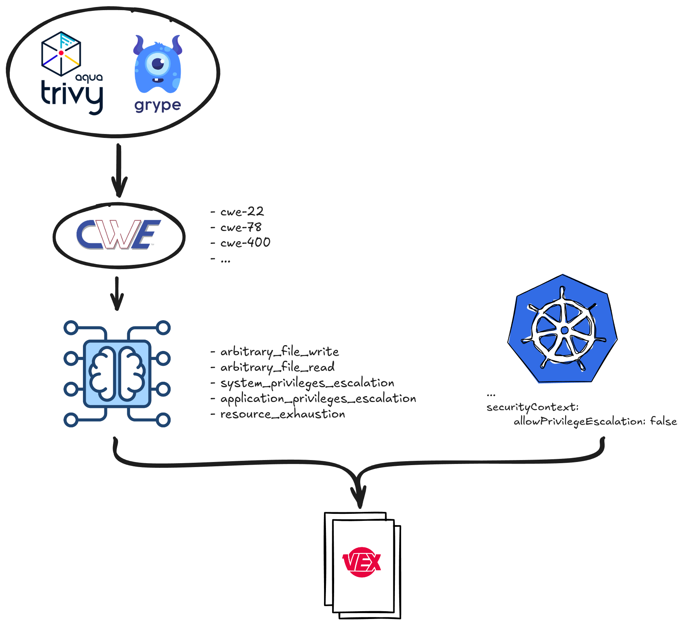

# Environment-Aware Vulnerability Suppression Using Security Context and VEX

 

**Alessio Greggi**
alessio.greggi@suse.com

---

# `$ whoami`

 

* **Alessio Greggi**
* **Job:** Software Engineer @ Rancher by SUSE 🦎
* **Hobbies:** 
  * Reading books📚
  * Taking random walks 🥾
* **Github:** [`github.com/alegrey91`](https://github.com/alegrey91)
---

# Introduction

Before we dive into the solution, let's align on the core technologies:

1.  **VEX** (Vulnerability Exploitability eXchange)
2.  **Security Context**
3.  **CWE** (Common Weakness Enumeration)

---

# VEX

## Vulnerability Exploitability eXchange

* **What:** An open standard format (JSON) that describes the *status* of vulnerabilities within a software product.
* **Why:** To solve the "False Positive" fatigue.
* **Function:** It tells scanners (like trivy or grype): *"Yes, this CVE exists in the library, but it is **not affected** in this specific context because..."*
* **Goal:** Reduce noise in vulnerability reports.

---

# Kubernetes Security Context

## Defining Privilege and Access Control

* **What:** A field in a Pod or Container manifest (`securityContext`) that defines privilege and access control settings.
* **Key Controls:**
    * `runAsUser` / `runAsGroup`
    * `privileged`
    * `allowPrivilegeEscalation`
    * `readOnlyRootFilesystem`
    * `capabilities` (drop ALL, add specific ones)
* **Why:** Reduce the attack surface.

---

# CWE

## Common Weakness Enumeration

**Categorizing the "Nature" of the Flaw**

* **What:** A community-developed list of software and hardware weakness types.
* **Difference from CVE:**
    * **CVE** = A specific instance of a vulnerability (e.g., CVE-2025-8110: Gogs Path Traversal Vulnerability).
    * **CWE** = The *category* of that vulnerability (e.g., CWE-22: Improper Limitation of a Pathname to a Restricted Directory)
* **Relevance:** Helps us understand *how* a vulnerability operates and *what* conditions it needs to succeed.

---

# The Problem
### Can we automate the generation of VEX documents?

*Manual VEX creation is tedious. We need a way to "prove" mitigation automatically.*

---

# The Problem Statement

We have scanners, and we have security configurations. Why don't they talk to each other?

1.  **Inference:** Can Kubernetes Security Contexts be used to systematically infer that certain classes of vulnerabilities are mitigated purely by configuration?
2.  **Automation:** Can this information be expressed via automatically generated **VEX** documents?

---

# The Idea: **vex8s**

**Project Goal:** Combine Vulnerability Reports + Deployment Manifests

github.com/alegrey91/vex8s

---

**The Workflow**

---

# The Model

### Example

* **Case Study:** CVE-2007-4559
* **CWE:** CWE-22 (Improper Limitation of a Pathname to a Restricted Directory)
* **Description:** *Directory traversal vulnerability in the (1) extract and (2) extractall functions in the tarfile module in Python allows user-assisted remote attackers to overwrite arbitrary files via a .. (dot dot) sequence in filenames in a TAR archive, a related issue to CVE-2001-1267.*

* **Classification:** `arbitrary_file_write` 

---

# The Model

### Text Classifier

* **Algorithm:** Multinomial Naive Bayes.
* **Task:** Analyze CVE descriptions to classify them into exploitation categories:
  * `arbitrary_file_write` 
  * `arbitrary_file_read`
  * `system_privileges_escalation`
  * `application_privileges_escalation`
  * `resource_exhaustion`
* **Dataset:** ~2000 labeled CVE descriptions
* **Repository:** `github.com/alegrey91/vex8s-model`

---

# The Status of vex8s

*Current State: **Experimental***

**Actionable Roadmap:**
* **ML Improvement:** Increasing the size of the dataset with more examples.
* **Broader Scope:** Identifying more CWEs that are mitigable by environment config.
* **Live Analysis:** Ability to analyze objects directly in the cluster via `KUBECONFIG`.

**Community:**
* **Trivy PR:** Added per-repo TLS configuration (beneficial for `vex8s-controller`).
  https://github.com/aquasecurity/trivy/pull/10030
* **OpenVEX Proposal:** Proposed adding the `partially_affected` label.
  https://github.com/openvex/spec/issues/61

---

# Demo Time 
### Vulnerabilities Suppression Using Security Context

---

# Limitations

This approach is powerful, but not a silver bullet:

* **Heuristic Nature:** Relies on probability (ML models) rather than absolute certainty. There is a margin for error.
* **Static Analysis Only:** It analyzes *configuration intent*, not runtime behavior.
* **Non-Substitutive:** It still requires a Security expert to ensure about its reliability.

---

# Other Approaches

**vexllm**
* **Approach:** Uses Large Language Models to generate VEX documents based on hints provided in input.
https://github.com/AkihiroSuda/vexllm

**kubescape**
* **Approach:** Focuses on eBPF runtime analysis, looking for executed binaries within the container image.
https://kubescape.io/docs/operator/generating-vex/

---

# Other Approaches

**vens**
* **Approach:** Transforms generic CVSS scores into contextual OWASP risk scores tailored to YOUR system using LLM intelligence.
https://github.com/venslabs/vens

**vex-generation-toolset**
* **Approach:** Open-source tooling for analyzing the impact of vulnerabilities in third-party dependencies and generating VEX documents.
https://github.com/vex-generation-toolset

---

# Other Approaches

**govulncheck**
* **Approach:** Govulncheck reports known vulnerabilities that affect Go code. It uses static analysis of source code or a binary's symbol table to narrow down reports to only those that could affect the application.
https://go.googlesource.com/vuln
`govulncheck -format openvex -mode binary ./bin/program`

---

# Thanks

---

**Questions?**

 

Alessio Greggi
alessio.greggi@suse.com
